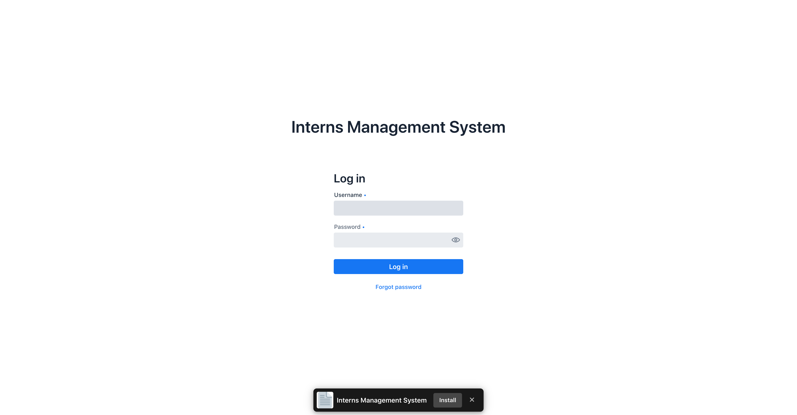
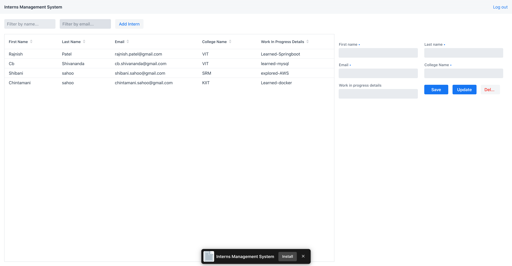

# Web Application developed in Spring Boot and Vaadin

The application is designed to maintain records of interns.

## Used MySQL for database

Configure database in application.properties

## Default credentials for Login

| USERNAME | user     |
| -------- | :------- |
| PASSWORD | password |

